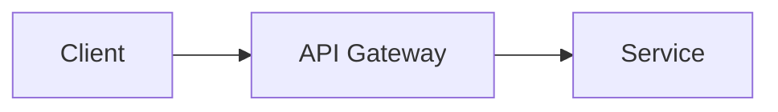

# Project Vigilion by CSE - Cyber at UoM - Documentation

Official documentation for the **Project Vigilion by CSE - Cyber at UoM** platform - a comprehensive cybersecurity auditing and monitoring system built with modern microservices architecture.

## 🌐 Live Documentation

Visit the live documentation site: [Coming Soon]

## 📚 Overview

This repository contains the complete technical documentation for the Project Vigilion by CSE - Cyber at UoM platform, built with [Docusaurus](https://docusaurus.io/). The documentation covers:

- **Platform Architecture** - System design, service communication, and infrastructure
- **Core Services** - Dashboard, API Gateway, and orchestration
- **Security Scanners** - Web Domain Scanner, Database Scanner, Code Scanner AI, and Misconfig Checker
- **Deployment Guide** - Kubernetes deployment with Kustomize overlays
- **API Reference** - Endpoint documentation and authentication flows
- **Development Guides** - Contributing, local setup, and best practices

## 🚀 Quick Start

### Prerequisites

- Node.js 18+ 
- npm or yarn

### Local Development

```bash
# Install dependencies
npm install

# Start development server
npm start
```

This command starts a local development server and opens up a browser window. Most changes are reflected live without having to restart the server.

### Build

```bash
npm run build
```

This command generates static content into the `build` directory and can be served using any static contents hosting service.

## 📖 Documentation Structure

```
docs/
├── intro/
│   ├── overview.md              # Platform introduction
│   └── architecture.md          # System architecture diagrams
├── core/
│   ├── dashboard.md             # Frontend documentation
│   └── api-gateway.md           # API Gateway routing & auth
├── scanners/
│   ├── web-domain-scanner.md    # Web scanning service
│   ├── database-scanner.md      # Database security scanner
│   ├── code-scanner.md          # AI-powered code analysis
│   └── misconfig-checker.md     # Infrastructure misconfig detection
├── infrastructure/
│   └── deployment.md            # Kubernetes deployment guide
├── audit/
│   └── overview.md              # Security audit features
└── contribution.md              # Contributing guidelines
```

## 🛠️ Tech Stack

- **Framework**: Docusaurus 3.x
- **Language**: TypeScript
- **Styling**: CSS Modules
- **Diagrams**: Mermaid
- **Math Notation**: LaTeX (via remark-math)
- **Deployment**: Dockerized static site

## 🐳 Docker Deployment

The documentation is containerized for production deployment:

```bash
# Build Docker image
docker build -t csecyber/cyber-suite-docs:latest .

# Run container
docker run -p 80:80 csecyber/cyber-suite-docs:latest
```

Access the documentation at `http://localhost`

## 📝 Contributing

### Adding New Documentation

1. Create a new `.md` file in the appropriate `docs/` subdirectory
2. Add frontmatter with `sidebar_position`:
   ```markdown
   ---
   sidebar_position: 1
   ---
   # Your Page Title
   ```
3. Update `sidebars.ts` if creating a new section
4. Test locally with `npm start`

### Writing Guidelines

- Use **Mermaid diagrams** for architecture and flow visualizations
- Use **Greek letter notation** ($\alpha$, $\beta$, $\gamma$, etc.) for port numbers
- Include **code examples** with proper syntax highlighting
- Add **links** to related documentation sections
- Keep content **concise** and **scannable**

### Diagram Examples

**Mermaid:**
````markdown

````

**LaTeX Math:**
```markdown
Port: $\alpha$ (alpha = 3000)
```

## 🔗 Related Repositories

- [Deployment-Repo](https://github.com/Cyber-Suite-CSE/Deployment-Repo) - Kubernetes deployment manifests
- [Cyber-Suite-Dashboard](https://github.com/Cyber-Suite-CSE/Cyber-Suite-Dashboard) - Next.js frontend
- [Cyber-Suite-API-Gateway](https://github.com/Cyber-Suite-CSE/Cyber-Suite-API-Gateway) - Express.js API Gateway
- [web-domain-scanner](https://github.com/Cyber-Suite-CSE/web-domain-scanner) - Web scanning service
- [Database-Security-Scanner](https://github.com/Cyber-Suite-CSE/Database-Security-Scanner) - Database auditing tool
- [Code-Scanner-AI](https://github.com/Cyber-Suite-CSE/Code-Scanner-AI) - AI code analysis
- [Deployment-Misconfig-Checker](https://github.com/Cyber-Suite-CSE/Deployment-Misconfig-Checker) - Infrastructure scanner
- [API-Tester](https://github.com/Cyber-Suite-CSE/API-Tester) - API security testing

## Monitoring & CI/CD

### Prometheus Monitoring
This service exposes a native, lightweight `/metrics` endpoint returning Prometheus-formatted telemetry (such as uptime, memory, and CPU usage).
- **Metrics Endpoint:** `/docs/metrics.txt`
- **Scraping Config:** Configured with annotations `prometheus.io/scrape: "true"` in the deployment manifest.

### CI/CD Pipeline
GitHub Actions workflow is located at `.github/workflows/deploy.yml` which triggers on push to `main` branch:
- **Build Optimization:** Uses `docker/setup-buildx-action@v3` with layer caching enabled (`cache-from: type=gha`, `cache-to: type=gha,mode=max`).
- **Target Registry:** `csecyber/cyber-suite-docs`
- **Tags Generated:** Dual tags for `:latest` and the unique commit hash `:${ github.sha }`.
