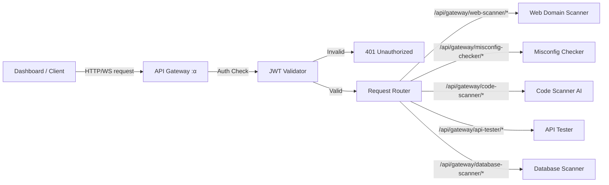

# API Gateway

## Overview

The **Vigilion API Gateway** is a critical infrastructure component that manages all incoming API traffic to the platform's backend services. Built with **Node.js**, **Express**, and **http-proxy-middleware**, it provides a unified entry point, centralized authentication, and dynamic routing capabilities.

## Architecture

## Deep Dive: Authentication & Routing Logic

### Authentication Flow (`src/routes/auth.ts`, `src/middleware/auth.ts`)
The Gateway enforces a strict **Admin-Only** access model using JSON Web Tokens (JWT).

1.  **Login**:
    *   Endpoint: `POST /api/auth/login`
    *   Logic: Compares request body `email`/`password` against `ADMIN_EMAIL`/`ADMIN_PASSWORD` env vars.
    *   Success: Signs a JWT (`HS256`, 24h expiry) and sets it as an **HttpOnly, Secure, SameSite=Strict** cookie named `auth_token`.

2.  **Verification**:
    *   Middleware: `authMiddleware` intercepts all requests to `/api/gateway/*`.
    *   Extraction: Reads `auth_token` from cookies.
    *   Validation: Verifies signature using `JWT_SECRET`. If valid, attaches payload to `req.user`.

### Dynamic Proxy Routing (`src/routes/gateway.ts`)
The gateway uses `http-proxy-middleware` with a custom router function to determine request targets dynamically.

*   **Routing Logic**:
    Input URL: `/api/gateway/<service-name>/<path>`
    
    1.  **Extraction**: Splits the URL path to identify `<service-name>` (e.g., `web-scanner`).
    2.  **Lookup**: Maps the name to a target URL defined in the `SERVICES` constant (loaded from ENV).
    3.  **Rewriting**: Removes the `/api/gateway/<service-name>` prefix.
    4.  **Forwarding**: Proxies the request to `Target URL + /<path>`.

*   **WebSocket Upgrades**:
    The proxy is configured with `ws: true`, allowing it to intercept HTTP `Upgrade` headers and establish persistent tunnels for services like the Database Scanner's real-time reporting.

## Configuration

The gateway is configured via environment variables:

| Variable | Description | Default |
| :--- | :--- | :--- |
| `PORT` | Server listening port | $\alpha$ |
| `JWT_SECRET` | Secret key for signing/verifying JWTs | (Required) |
| `API_TESTER_URL` | Internal URL for API Tester | `http://api-tester:`$\epsilon$ |
| `WEB_SCANNER_URL` | Internal URL for Web Scanner | `http://web-scanner-api:`$\beta$ |
| `DATABASE_SCANNER_URL` | Internal URL for DB Scanner | `http://db-scanner:`$\gamma$ |
| `MISCONFIG_CHECKER_URL` | Internal URL for Misconfig Checker | `http://misconfig-checker:`$\delta$ |
| `CODE_SCANNER_URL` | Internal URL for Code Scanner | `http://code-scanner-ai:`$\zeta$ |

## Usage

### Authentication

Clients must include a valid JWT in the `Authorization` header:
`Authorization: Bearer <token>`

### Routing Table

| Route Prefix | Target Service |
| :--- | :--- |
| `/api/gateway/api-tester/` | API Tester |
| `/api/gateway/web-scanner/` | Web Domain Scanner |
| `/api/gateway/database-scanner/` | Database Security Scanner |
| `/api/gateway/misconfig-checker/` | Deployment Misconfig Checker |
| `/api/gateway/code-scanner/` | Code Scanner AI |

## Development & Execution

*   **Local Setup**: Running the gateway service locally in development requires installing the package dependencies and starting the local dev script. Doing so executes the compiler daemon and starts the application, displaying the endpoint details in your terminal console.
*   **Code Quality**: Linter rules are configured to run checks on project styles and check for static analysis syntax issues.
