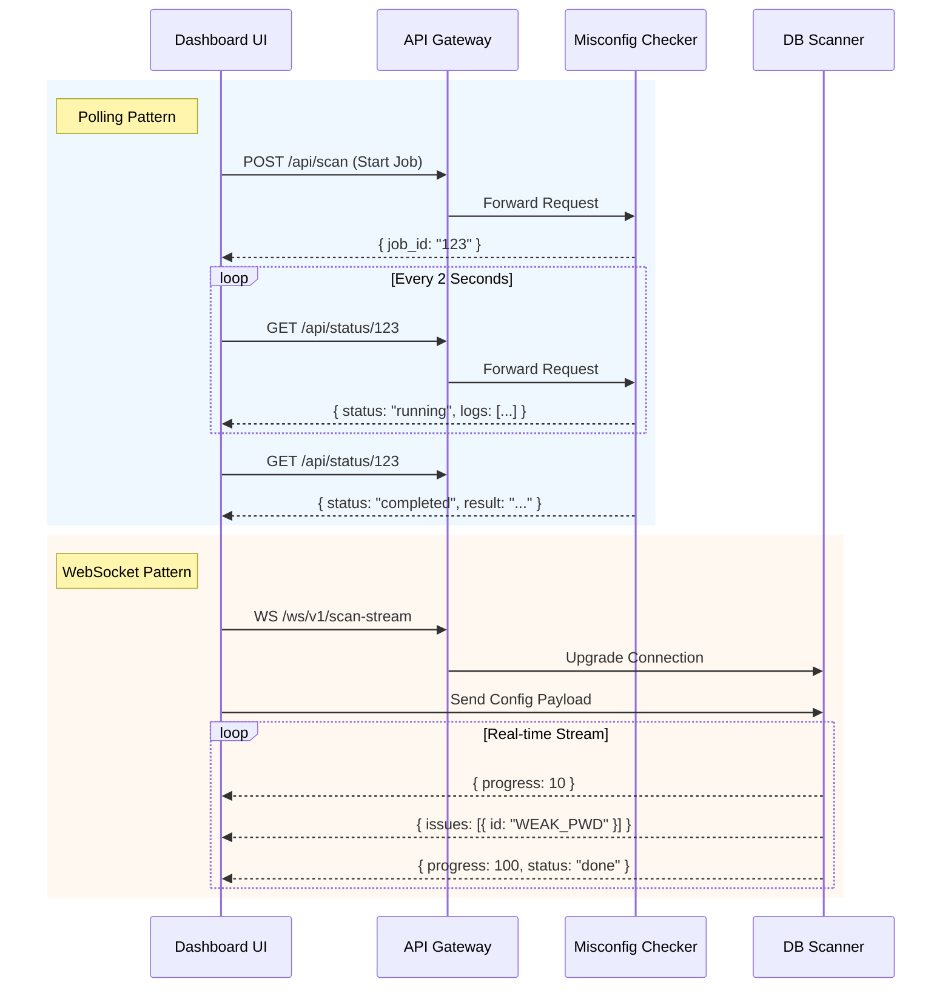

# Cyber Suite Dashboard

## Overview

The **Cyber Suite Dashboard** is the primary user interface and control plane for the entire platform. Built with **Next.js 15 (App Router)** and **TypeScript**, it provides a modern, responsive, and intuitive experience for security analysts and administrators.

## Features

*   **Unified View**: Aggregates data from all connected scanners (Web, Database, Code, API).
*   **Real-time Monitoring**: Uses WebSockets to display live scan progress and results.
*   **Authentication**: Secure login system with role-based access control (RBAC).
*   **Configuration Management**: UI-driven configuration for scanner settings.
*   **API Gateway Integration**: Acts as a reverse proxy to route requests to backend services.

## Architecture

The Dashboard follows a client-server architecture:

*   **Frontend (Browser)**: React components styled with Tailwind CSS and Shadcn/ui.
*   **Backend (Next.js API)**: Handles API requests, authentication, and acts as a BFF (Backend for Frontend).
*   **Communication**:
    *   **REST API**: Used for synchronous operations (e.g., fetching scan history, configuration).
    *   **WebSockets**: Used for asynchronous, real-time updates (e.g., detailed scan logs).

## Key Components

*   **`app/`**: Next.js App Router structure.
*   **`components/`**: Reusable UI components.
    *   `sidebar.tsx`: Navigation menu.
    *   `sections/`: Specific UI sections for each scanner type.
*   **`lib/`**: Utility functions and API clients.


## Deep Dive: State Management & Real-time Updates

The Dashboard employs two distinct patterns for handling long-running security scans: **Polling** and **WebSockets**.

### 1. Polling Pattern (Misconfig Checker)
Used for services where scans are job-based and updates are episodic.

*   **Component**: `components/sections/misconfig-checker.tsx`
*   **Logic**:
    1.  **Submission**: POST request to `/api/scan` returns a `job_id`.
    2.  **Monitoring**: `pollResults` function sets an interval (2s) to call `/api/status/:job_id`.
    3.  **State Update**: React state (`jobStatus`) is replaced with the latest API response.
    4.  **Completion**: Polling stops when status is `completed` or `failed`.

### 2. WebSocket Streaming Pattern (Database Scanner)
Used for high-frequency updates where real-time feedback is critical (e.g., password auditing progress).

*   **Component**: `components/sections/database-scanner/scan-results.tsx`
*   **Logic**:
    1.  **Connection**: Opens a WebSocket connection to `/ws/v1/scan-stream` via the API Gateway.
    2.  **Payload**: Sends the scan configuration (target DB, selected tests) immediately upon connection.
    3.  **Streaming**:
        *   `onmessage`: Receives JSON chunks containing `progress` (number) or `issues` (array of findings).
        *   `setIssues`: Uses functional state upgrades to append new findings or update existing ones without overwriting.
    4.  **Closure**: Server sends `{status: "done"}` to signal completion.

### Sequence Diagram: Data Fetching Strategies



## Docker Deployment


1.  **Install Dependencies**:
    ```bash
    npm install
    ```

2.  **Start Dev Server**:
    ```bash
    npm run dev
    ```
    Access at `http://localhost:3000`.

## Docker Deployment

The application is containerized using a multi-stage `Dockerfile.prod` for optimized production builds.

```bash
docker build -f Dockerfile.prod -t registry/cyber-suite-dashboard .
```
