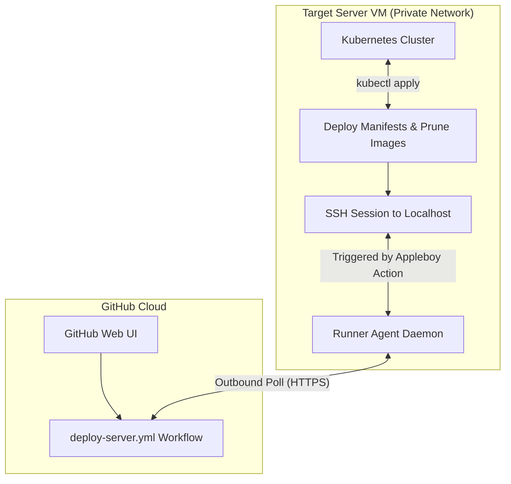

<head>
  <title>Continuous Integration & Deployment (CI/CD) | Vigilion Docs</title>
  <meta name="description" content="Detailed overview of Vigilion's CI/CD workflows, self-hosted GitHub Actions runner configuration, deployment scripts, and container image updates." />
</head>

# Continuous Integration & Deployment (CI/CD)

This page explains how Project Vigilion's automated build and deployment pipelines are structured, how the self-hosted runner operates, and how to update services on your target server.

---

## 1. Automated Build Pipelines (Docker Hub)

Every microservice repository in the project has a standardized GitHub Actions workflow at `.github/workflows/deploy.yml` that builds and pushes Docker images to Docker Hub when changes are merged into the `main` branch.

### Workflow Pipeline Design

*   **Trigger:** Automatically runs on a `push` commit to the `main` branch.
*   **Dual Tagging Strategy:** Pushes two image tags for every build:
    1.  `:latest`: Represents the current active release.
    2.  `:${{ github.sha }}`: The specific Git commit hash (useful for tracking history or rollbacks).
*   **Performance Caching:** Utilizes `docker/setup-buildx-action@v3` along with GitHub Actions native layer caching (`cache-from: type=gha`, `cache-to: type=gha,mode=max`) to speed up subsequent image build times.
*   **Context Optimization:** Uses a standard `.dockerignore` file excluding `.git/`, `.github/`, and local configurations to ensure changes to workflow scripts do not invalidate the Docker build context.

---

## 2. Host Self-Hosted GitHub Actions Runner

To run automated deployment workflows directly inside a private, firewall-protected server environment, we set up a self-hosted runner at the organization level (`Cyber-Suite-CSE`).

### Why a Self-Hosted Runner is Required

Typically, GitHub-hosted runners (`ubuntu-latest`) execute workflows on GitHub's cloud servers. However, since our target VM server resides behind a private university network/VPN firewall, public internet hosts cannot initiate incoming SSH connections to it. 

The self-hosted runner solves this networking constraint:
1. **Outbound Only Connection:** The runner agent is installed directly on the target VM and initiates an outbound HTTPS websocket connection to GitHub.
2. **Internal Job Polling:** It continuously polls GitHub for pending jobs labeled `self-hosted`.
3. **Local Execution:** When a job is triggered, the runner agent retrieves the execution steps from GitHub and runs them directly inside the target VM's environment.



### Installation and Systemd Configuration

To register and run the self-hosted runner agent persistently as a system daemon on the VM:

1.  **Create and Navigate to a Runner Directory**: Create a dedicated workspace directory on the server to house the runner binaries and run context.
2.  **Download and Extract the Runner Package**: Fetch the target runner agent archive using a download tool (like `curl`) matching your platform architecture, and extract the package files within the runner directory.
3.  **Register the Runner**: Obtain a unique organization runner token from your GitHub Actions settings page, and invoke the configuration script. This registers the runner under your organization profile (e.g. `Cyber-Suite-CSE`) with identifiers and tags (e.g. `self-hosted`).
4.  **Configure as a Persistent systemd Service**: Install the runner script as a system service wrapper and start the daemon. This ensures the runner process persists when the active SSH session is closed and starts automatically on system boot. You can check the service status to verify it has entered the active running state.

---

## 3. Server Deployment Pipeline (`deploy-server.yml`)

The `Deployment-Repo` contains the primary pipeline workflow `.github/workflows/deploy-server.yml` which automates platform deployments.

### Workflow Configuration
*   **Runs On:** `self-hosted` (guarantees the job executes inside the private VM environment).
*   **Trigger:** `workflow_dispatch` (manually run from the GitHub Actions UI).
*   **Inputs:**
    *   `overlay`: A dropdown choice selecting the target overlay (`dev` or `prod`).

### Job Pipeline Mechanics
The job runs `appleboy/ssh-action@v1.0.3` to establish a local loopback SSH session on the VM to execute the deployment script.

```yaml
jobs:
  deploy:
    runs-on: self-hosted
    steps:
      - name: SSH Remote Connection and Deploy
        uses: appleboy/ssh-action@v1.0.3
        with:
          host: ${{ secrets.SERVER_HOST }}
          username: ${{ secrets.SERVER_USER }}
          key: ${{ secrets.SERVER_SSH_KEY }}
          script: |
            cd ~/Deployment-Repo
            git pull origin main
            kubectl apply -k k8s/overlays/${{ github.event.inputs.overlay }}
            kubectl rollout restart deployment -n cyber-suite
            docker image prune -a -f
```

### Manual Setup Steps for SSH-Action

For the deployment action to establish a secure shell connection to the loopback target interface, configure public key authentication:

1.  **Generate an SSH Keypair on the Server**: Generate a dedicated, passwordless RSA keypair on the VM using key-generation tools.
2.  **Authorize the Public Key**: Append the newly generated public key signature to the host's `authorized_keys` file, adjusting the file and directory permission levels (`600` for the file, `700` for the directory) to ensure the server authorizes keys correctly.
3.  **Configure GitHub Repository Secrets**: Navigate to your GitHub repository settings under Actions Secrets, and map the connection fields:
    *   `SERVER_HOST`: Set the server target IP or loopback address.
    *   `SERVER_USER`: Enter the deployment username.
    *   `SERVER_SSH_KEY`: Store the contents of the generated private key.

:::note
**SECURITY WARNING:** Ensure the SSH key has no passphrase, otherwise the automated deployment action will fail since it cannot respond to interactive prompts. Keep the private key secure and restrict access to authorized repository administrators.
:::

### Manual Steps to Trigger the Deployment

1.  **Ensure Runner is Online**: Confirm the registered runner's status is idle/online under your organization's Settings tab in GitHub.
2.  **Run the Workflow**: Locate the target deployment workflow under the repository Actions tab, trigger the manual workflow execution, select the appropriate overlay configuration, and run the job.
3.  **Monitor Progress**: Monitor the job execution trace on the GitHub console, or retrieve the active pod list within the target namespace to watch the microservices roll out in real-time.

---

## 4. Manual Restarts & Updating Images

When a new image is pushed to Docker Hub, Kubernetes does not automatically download it unless a pod is restarted (since we use `:latest` tags). Our overlays enforce `imagePullPolicy: Always` on all deployments, meaning Kubernetes will check Docker Hub for the newest image digest whenever a pod restarts.

### 1. Rolling Restart of the Suite
To pull the new images and perform a zero-downtime rolling update, trigger a rollout restart on the entire namespace deployment or target specific deployments directly. This forces Kubernetes to retrieve the updated layers.

### 2. Monitoring the Update Rollout
Monitor the deployment status using standard rollout status commands to ensure the old container instances are cleanly replaced by the new builds.

### 3. Container Runtime Cache Clearing (Troubleshooting)
If the K3s runtime serves cached layers instead of pulling the fresh build from Docker Hub, perform a clean reload sequence:
1.  **Scale Down Deployments**: Scale down all active suite deployments to zero replicas to stop the active pods.
2.  **Remove Cache**: Log into the node and remove the target image explicitly from the container runtime cache using container CLI utilities (such as `crictl`).
3.  **Scale Up Deployments**: Scale the deployments back up to their original replica counts. This forces the runtime to perform a fresh image pull from the registry.
