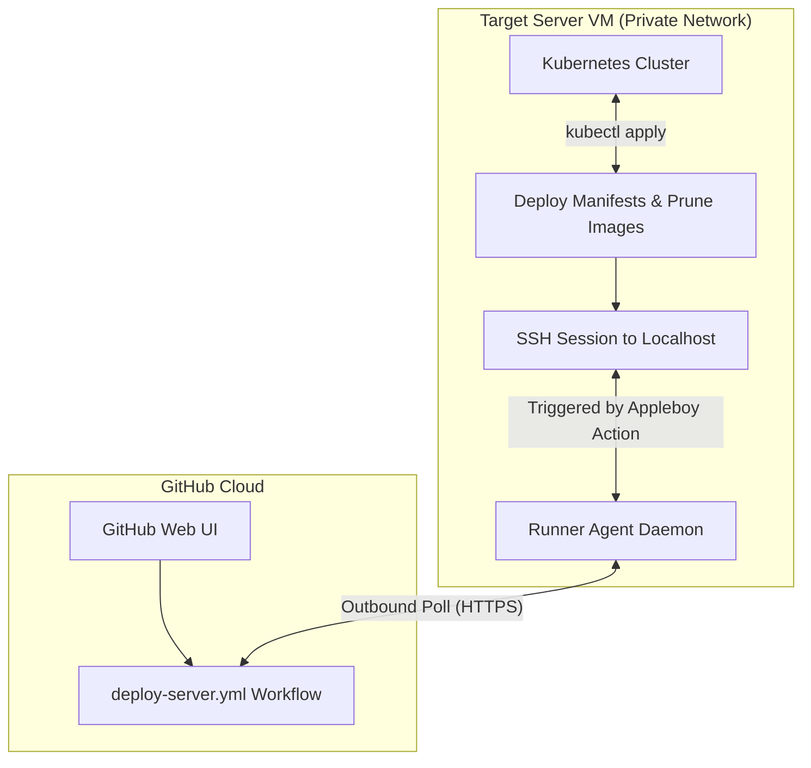

<head>
  <title>Continuous Integration & Deployment (CI/CD) | Vigilion Docs</title>
  <meta name="description" content="Detailed overview of Vigilion's CI/CD workflows, self-hosted GitHub Actions runner configuration, deployment scripts, and container image updates." />
</head>

# Continuous Integration & Deployment (CI/CD)

This page explains how Project Vigilion's automated build and deployment pipelines are structured, how the self-hosted runner operates, and how to update services on your target server.

---

## 1. Automated Build Pipelines (Docker Hub)

Every microservice repository in the project has a standardized GitHub Actions workflow at `.github/workflows/deploy.yml` that builds and pushes Docker images to Docker Hub when changes are merged into the `main` branch.

### Workflow Pipeline Design

*   **Trigger:** Automatically runs on a `push` commit to the `main` branch.
*   **Dual Tagging Strategy:** Pushes two image tags for every build:
    1.  `:latest`: Represents the current active release.
    2.  `:${{ github.sha }}`: The specific Git commit hash (useful for tracking history or rollbacks).
*   **Performance Caching:** Utilizes `docker/setup-buildx-action@v3` along with GitHub Actions native layer caching (`cache-from: type=gha`, `cache-to: type=gha,mode=max`) to speed up subsequent image build times.
*   **Context Optimization:** Uses a standard `.dockerignore` file excluding `.git/`, `.github/`, and local configurations to ensure changes to workflow scripts do not invalidate the Docker build context.

---

## 2. Host Self-Hosted GitHub Actions Runner

To run automated deployment workflows directly inside a private, firewall-protected server environment, we set up a self-hosted runner at the organization level (`Cyber-Suite-CSE`).

### Why a Self-Hosted Runner is Required

Typically, GitHub-hosted runners (`ubuntu-latest`) execute workflows on GitHub's cloud servers. However, since our target VM server resides behind a private university network/VPN firewall, public internet hosts cannot initiate incoming SSH connections to it. 

The self-hosted runner solves this networking constraint:
1. **Outbound Only Connection:** The runner agent is installed directly on the target VM and initiates an outbound HTTPS websocket connection to GitHub.
2. **Internal Job Polling:** It continuously polls GitHub for pending jobs labeled `self-hosted`.
3. **Local Execution:** When a job is triggered, the runner agent retrieves the execution steps from GitHub and runs them directly inside the target VM's environment.



### Installation and Systemd Configuration

To register and run the self-hosted runner agent persistently as a system daemon on the VM:

1.  **Create and navigate to a runner directory:**
    ```bash
    mkdir ~/actions-runner && cd ~/actions-runner
    ```
2.  **Download the latest runner package:**
    ```bash
    curl -o actions-runner-linux-x64-2.334.0.tar.gz -L https://github.com/actions/runner/releases/download/v2.334.0/actions-runner-linux-x64-2.334.0.tar.gz
    tar xzf ./actions-runner-linux-x64-2.334.0.tar.gz
    ```
3.  **Register the runner with the organization/repository token:**
    Retrieve the registration token from **GitHub Settings** -> **Actions** -> **Runners** -> **New self-hosted runner**, and execute:
    ```bash
    ./config.sh --url https://github.com/Cyber-Suite-CSE --token <ORG_RUNNER_TOKEN> --name "vigilion-server-runner" --labels self-hosted
    ```
4.  **Configure as a Persistent systemd Service:**
    By default, running `./run.sh` will close when your SSH connection ends. Install it as a system daemon:
    ```bash
    # Install the systemd service files
    sudo ./svc.sh install

    # Start the daemon
    sudo ./svc.sh start

    # Verify status is Active (Running)
    sudo ./svc.sh status
    ```

---

## 3. Server Deployment Pipeline (`deploy-server.yml`)

The `Deployment-Repo` contains the primary pipeline workflow `.github/workflows/deploy-server.yml` which automates platform deployments.

### Workflow Configuration
*   **Runs On:** `self-hosted` (guarantees the job executes inside the private VM environment).
*   **Trigger:** `workflow_dispatch` (manually run from the GitHub Actions UI).
*   **Inputs:**
    *   `overlay`: A dropdown choice selecting the target overlay (`dev` or `prod`).

### Job Pipeline Mechanics
The job runs `appleboy/ssh-action@v1.0.3` to establish a local loopback SSH session on the VM to execute the deployment script.

```yaml
jobs:
  deploy:
    runs-on: self-hosted
    steps:
      - name: SSH Remote Connection and Deploy
        uses: appleboy/ssh-action@v1.0.3
        with:
          host: ${{ secrets.SERVER_HOST }}
          username: ${{ secrets.SERVER_USER }}
          key: ${{ secrets.SERVER_SSH_KEY }}
          script: |
            cd ~/Deployment-Repo
            git pull origin main
            kubectl apply -k k8s/overlays/${{ github.event.inputs.overlay }}
            kubectl rollout restart deployment -n cyber-suite
            docker image prune -a -f
```

### Manual Setup Steps for SSH-Action

For `appleboy/ssh-action` to connect to the target shell, you must configure public key authentication:

1.  **Generate an SSH Keypair on the server:**
    If you don't already have a dedicated key pair for GitHub deployments:
    ```bash
    ssh-keygen -t rsa -b 4096 -f ~/.ssh/github_deploy_key -N ""
    ```
2.  **Authorize the Public Key:**
    Append the public key to the authorized keys file so the host accepts incoming connections with this key:
    ```bash
    cat ~/.ssh/github_deploy_key.pub >> ~/.ssh/authorized_keys
    chmod 600 ~/.ssh/authorized_keys
    chmod 700 ~/.ssh
    ```
3.  **Configure GitHub Repository Secrets:**
    Navigate to your GitHub repository settings under **Settings** -> **Secrets and variables** -> **Actions**, and add the following repository secrets:
    *   `SERVER_HOST`: The IP address or domain of the VM (e.g., `127.0.0.1` or the internal address since the runner is local).
    *   `SERVER_USER`: The VM system username (e.g. `cseroot`).
    *   `SERVER_SSH_KEY`: The raw private key content (`cat ~/.ssh/github_deploy_key`).

:::note
**SECURITY WARNING:** Do not add passphrase-protected SSH keys, as the GitHub Action requires passwordless key entry to run non-interactively. Ensure your private key `SERVER_SSH_KEY` is kept secure and never exposed.
:::

### Manual Steps to Trigger the Deployment

1.  **Ensure Runner is Online:** Check **GitHub Settings** -> **Actions** -> **Runners** to ensure your self-hosted runner shows an `Idle` (Green) status.
2.  **Run the Workflow:**
    *   Go to the **Actions** tab in the `Deployment-Repo` repository.
    *   Select **Deploy to Server** from the sidebar.
    *   Click **Run workflow**.
    *   Choose the target overlay branch/overlay (`dev` or `prod`).
    *   Click the green **Run workflow** button.
3.  **Monitor Progress:**
    *   Click on the running job in the actions list to watch logs.
    *   Alternatively, log into the server and run `kubectl get pods -n cyber-suite -w` to monitor the microservice rollout.

---

## 4. Manual Restarts & Updating Images

When a new image is pushed to Docker Hub, Kubernetes does not automatically download it unless a pod is restarted (since we use `:latest` tags). Our overlays enforce `imagePullPolicy: Always` on all deployments, meaning Kubernetes will check Docker Hub for the newest image digest whenever a pod restarts.

### 1. Rolling Restart of the Suite
To pull the new images and perform a zero-downtime rolling update, execute a rollout restart:
```bash
# Restart all microservices in the namespace
kubectl rollout restart deployment -n cyber-suite

# Restart a specific service (e.g. docs only)
kubectl rollout restart deployment/docs -n cyber-suite
```

### 2. Monitoring the Update Rollout
Watch the progress of the container replacement:
```bash
kubectl rollout status deployment/docs -n cyber-suite
```

### 3. Container Runtime Cache Clearing (Troubleshooting)
If K3s' containerd runtime serves cached image layers instead of pulling the newly built layers from Docker Hub, run a clean reload sequence:

1.  **Scale the deployments down to 0:**
    ```bash
    kubectl scale deployment --all --replicas=0 -n cyber-suite
    ```
2.  **Remove cached images from the runtime (crictl):**
    ```bash
    sudo k3s crictl rmi docker.io/csecyber/cyber-suite-docs:latest
    ```
3.  **Scale the deployments back up to 1:**
    ```bash
    kubectl scale deployment --all --replicas=1 -n cyber-suite
    ```
