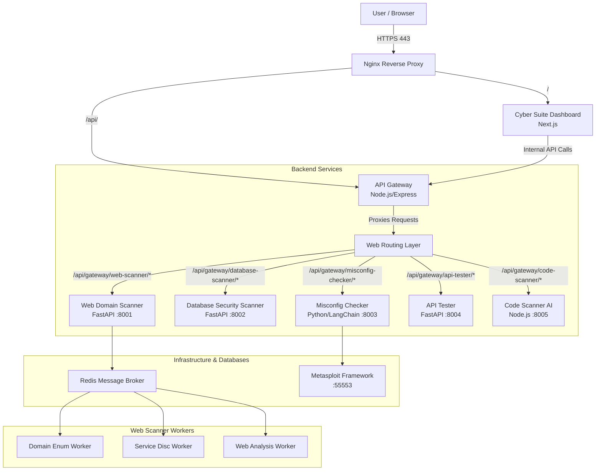
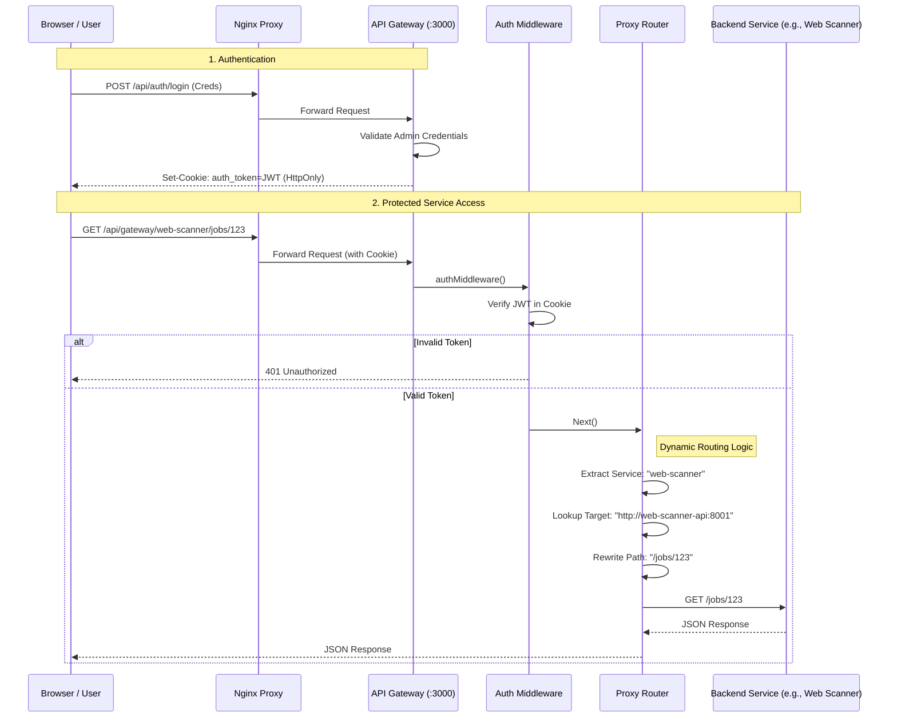
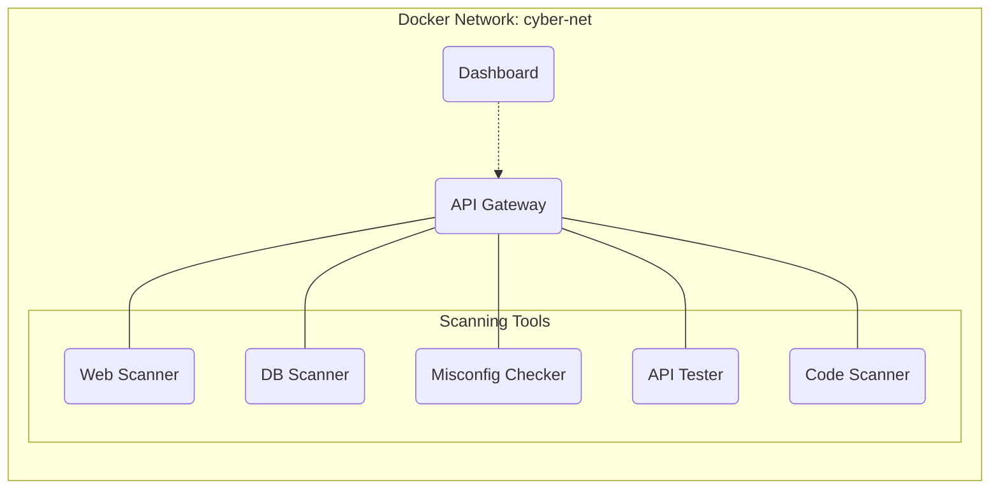

# System Architecture

## Overview

The **Cyber Suite CSE** platform is a comprehensive cybersecurity auditing and monitoring system composed of multiple specialized microservices. The architecture follows a microservices pattern, orchestrated via Docker Compose, with a central Dashboard and API Gateway for unified access and control.

## High-Level Architecture

## Service Communication Flow

1.  **Ingress**: All external traffic enters through the **Nginx** reverse proxy on ports 80 (redirects to 443) and 443 (SSL).
2.  **Frontend Serving**: Nginx routes standard web requests (`/`, `/_next`) to the **Cyber Suite Dashboard** container.
3.  **API Routing**: Requests destined for backend services (`/api/...`) are routed to the **Cyber Suite API Gateway**.
4.  **Service Orchestration**: The API Gateway validates authentication tokens (JWT) and routes the request to the appropriate internal microservice (e.g., `web-domain-scanner-api`, `db-security-scanner`).
5.  **Inter-Service Communication**: Services communicate over a dedicated Docker bridge network (`cyber-net`).

## Request Lifecycle (Deep Dive)

The following sequence diagram illustrates the exact flow of a request from the user's browser to a backend service (e.g., Web Domain Scanner).

## Network Topology & Isolation

| Service | Container Name | Internal Port | Description |
| :--- | :--- | :--- | :--- |
| **Dashboard** | `cyber-suite-dashboard` | 3000 | Frontend UI (Next.js) and BFF (Backend for Frontend). |
| **API Gateway** | `cyber-suite-api-gateway` | 3000 | Central authentication and routing hub. |
| **Web Domain Scanner** | `web-domain-scanner-api` | 8001 | Distributed scanning system for web assets. |
| **DB Scanner** | `db-security-scanner` | 8002 | Scans databases (Postgres, MySQL) for misconfigurations. |
| **Misconfig Checker** | `deployment-misconfig-checker` | 8003 | AI-driven agent (Nikto, Nmap, WPScan, MSF) for vulnerability detection. |
| **API Tester** | `api-tester` | 8004 | Tool for defining and running API security tests. |
| **Code Scanner AI** | `code-scanner-ai` | 8005 | AI-powered static application security testing (SAST). |
| **Metasploit** | `metasploit` | 55553 | RPC service for exploitation tasks used by Misconfig Checker. |
| **Redis** | `web-scanner-redis` | 6379 | Message broker for the Web Domain Scanner's async workers. |

## Network Topology

All services are connected to the `cyber-net` bridge network, ensuring they can resolve each other by container name while remaining isolated from the host's external network, except for explicitly exposed ports (managed by `docker-compose.yml`).

