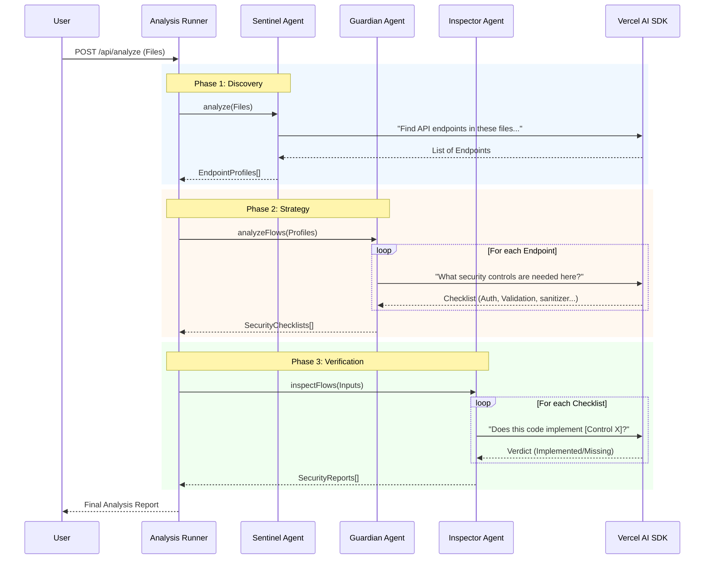

# Code Scanner AI

## Overview

**Code Scanner AI** is an intelligent static application security testing (SAST) tool that uses a multi-agent AI system to analyze codebases for vulnerabilities, missing security controls, and best practice violations.

## Key Features

*   **Multi-Agent Architecture**: Uses three specialized AI agents (Sentinel, Guardian, Inspector) for deep analysis.
*   **Broad Language Support**: Automatically detects frameworks (Next.js, Express, Django, Flask, etc.) and adjusts analysis accordingly.
*   **Interactive Reporting**: Generates visual reports with security scores, finding distribution, and detailed remediation advice.
*   **Flexible Input**: Supports ZIP file uploads and GitHub repository URLs.

## Deep Dive: Multi-Agent Analysis Pipeline

The scanning process is an orchestrated pipeline involving three specialized AI agents, each performing a distinct phase of analysis.

### Phase 1: Sentinel Agent (Endpoint Discovery)
*   **Goal**: Create a map of the application's attack surface.
*   **Process**:
    *   Parses the file tree to identify route handlers (e.g., `pages/api/**/*.ts`, `app/routes/**/*.py`).
    *   Analyzes entry points to determine input types (JSON, Query Params) and output types.
    *   Generates `EndpointProfile` objects for each discovered route.

### Phase 2: Guardian Agent (Contextual Rules)
*   **Goal**: Define *what* needs to be secured for each specific endpoint.
*   **Process**:
    *   Consumes `EndpointProfile`s from Sentinel.
    *   Consults a knowledge base of security standards (OWASP, CWE) tailored to the detected framework.
    *   Produces a `SecurityChecklist` containing required and recommended controls (e.g., "Implement Rate Limiting", "Validate JSON Schema").

### Phase 3: Inspector Agent (Code Verification)
*   **Goal**: Verify if the required controls are actually implemented.
*   **Process**:
    *   Performs a line-by-line static analysis of the source code against the `SecurityChecklist`.
    *   Identifies missing controls and active vulnerabilities.
    *   Generates a `SecurityReport` with severity scores and remediation snippets.

### Sequence Diagram: Analysis Flow

1.  **Sentinel Agent**: Discovers API endpoints and traces code flow.
2.  **Guardian Agent**: Generates a tailored security checklist based on OWASP and framework best practices.
3.  **Inspector Agent**: Performs line-by-line code inspection to detect vulnerabilities and verify controls.

## Tech Stack

*   **Frontend/Backend**: Next.js 16 (React 19), TypeScript
*   **UI Components**: Shadcn/ui, Tailwind CSS
*   **AI Engine**: Vercel AI SDK (OpenAI GPT-4 / Anthropic Claude)
*   **Charts**: Recharts

## Deployment

The service is deployed as a Docker container listening on internal port `$\zeta$`.

**Environment Variables:**
*   `default_model`: The AI model to use (e.g., `gpt-4.1-nano`).
*   `OPENAI_API_KEY`: Required for OpenAI models.
*   `ANTHROPIC_API_KEY`: Required for Claude models.
*   `NEXT_PUBLIC_API_URL`: Internal API URL.

## Usage

1.  Access the **Code Scanner** section in the Dashboard.
2.  Upload a ZIP file or provide a GitHub URL.
3.  Monitor the real-time analysis logs.
4.  Review the final security report and score.
