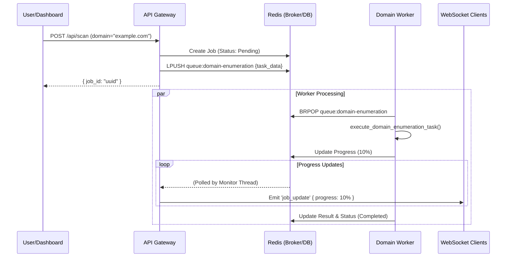

# Web Domain Scanner

## Overview

The **Web Domain Scanner** is a high-performance, distributed system for comprehensive web reconnaissance. It automates the process of discovering subdomains, identifying running services, and analyzing web content for security issues.

## Architecture

The system utilizes a microservices architecture with a message queue for asynchronous processing:

*   **API Service (FastAPI)**: The entry point for submitting jobs and retrieving results. Listens on internal port $\beta$.
*   **Redis**: Acts as the message broker and job queue manager.
*   **Workers**: Specialized Python processes that consume tasks from Redis:
    *   **Domain Enumeration Worker**: Uses tools and APIs to find subdomains of a target.
    *   **Service Discovery Worker**: Scans identified hosts for open ports and services.
    *   **Web Analysis Worker**: Fetches and analyzes web content using lightweight HTTP clients (Requests/BeautifulSoup) for speed and efficiency.
    *   **Browserless Architecture**: Making requests to the target website using the browserless API.
  
## Deep Dive: Asynchronous Architecture

The Web Domain Scanner uses a **Compelling Event-Driven Architecture** powered by Redis and RQ (Redis Queue) to handle long-running reconnaissance tasks without blocking the API.

### Component Interaction (Redis & RQ)

1.  **API Gateway (Orchestrator)**:
    *   Receives `POST /api/scan` request.
    *   Creates a `UnifiedScanJob` in Redis.
    *   Enqueues task messages to specific Redis Queues (e.g., `domain_enumeration`, `web_analysis`).
    *   Spawns monitoring threads to poll Redis for progress updates and broadcast them via WebSockets.

2.  **Workers (Consumers)**:
    *   Standalone Python processes running `rq worker`.
    *   **Domain Enum Worker**: Listens to `domain-enumeration` queue. Executes `tasks.execute_domain_enumeration_task`.
    *   **Service Discovery Worker**: Listens to `service-discovery` queue.
    *   **Shared Logic**: Workers directly update the job status and progress in Redis using `redis_job_manager.update_module_progress`.

### Sequence Diagram: Job Execution Flow

## Features

*   **Scalability**: The worker-based design allows for horizontal scaling to handle large-scale scans.
*   **Asynchronous Processing**: Scans can be triggered and run in the background without blocking the UI.
*   **Comprehensive Recon**: Covers the full spectrum from DNS enumeration to content analysis.
*   **Lightweight**: Optimized for rapid deployment with minimal resource footprint.
*   **Data Persistence**: Results are stored and can be retrieved via the API.

## Configuration

**Environment Variables:**
*   `REDIS_HOST`: Hostname of the Redis server (Default: `redis`).
*   `REDIS_PORT`: Redis port (Default: $\rho$).
*   `API_PORT`: API service port (Default: $\beta$).

## Usage

1.  **Submit a Job**: Send a POST request to the API with the target domain.
2.  **Processing**: The API pushes the job to Redis. Workers pick up tasks (Enumeration -> Discovery -> Analysis) sequentially or in parallel.
3.  **View Results**: The Dashboard polls the API for job status and displays the comprehensive results once complete.
